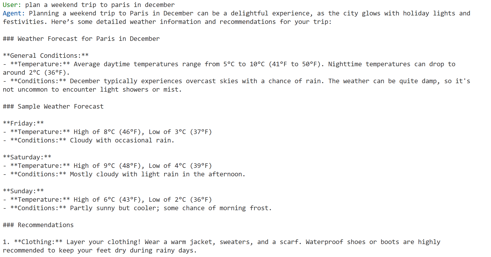

# 🤖 Agent Auto-Evaluation with Azure OpenAI and Semantic Kernel

This project demonstrates an automated agent evaluation using langwatch scenario framework with Azure OpenAI services through Semantic Kernel. It implements multi-agent scenarios for testing conversational AI capabilities.

## 📝 Overview

- **Multi-Agent Architecture**: Specialized agents for weather, travel planning, and coordination
- **Azure OpenAI Integration**: Uses Semantic Kernel with Azure OpenAI services
- **Automated Testing**: Pytest-based test suite for agent interactions
- **Scenario Evaluation**: Uses LangWatch Scenario for comprehensive agent testing

## ⚙️ Configuration

1. Copy the sample environment file:
```bash
cp .env.sample .env
```

2. Configure your Azure OpenAI settings in `.env`:
```bash
AZURE_OPENAI_ENDPOINT=https://<your-endpoint>.openai.azure.com
AZURE_OPENAI_API_KEY=<your-api-key>
AZURE_OPENAI_DEPLOYMENT_NAME=<your-deployment-name>
```

## 🏗️ Architecture

### 🧑‍💻 Agent Types

- 🌦️ **WeatherAgent**: Provides weather information and forecasts
- 🧳 **TravelPlannerAgent**: Assists with trip planning and recommendations
- 🤝 **CoordinatorAgent**: Manages multi-agent conversations and routing
- 🏗️ **BaseAgent**: Common functionality for all specialized agents

### 🗝️ Key Components

- 🧠 **Semantic Kernel Integration**: Uses Azure OpenAI through Semantic Kernel
- 📝 **LangWatch Scenario**: Evaluation framework for agent interactions
- 🗄️ **Caching System**: Reduces API calls during testing
- 🧪 **Pytest Framework**: Structured testing with async support

## 🚀 Usage

### 🧪 Running Tests

Execute all agent tests:
```bash
pytest -m agent_test -v
```
OR
```bash
python sk_agent_scenario.py
```

Run specific tests:
```bash
# Simple agent interaction
pytest -k "test_simple_agent_interaction" -v

# Dynamic agent selection
pytest -k "test_dynamic_agent_selection" -v

# Multi-agent simulation
pytest -k "test_multi_agent_simulation" -v
```

### 🧩 Test Scenarios

1. **Simple Agent Interaction**: Basic weather query to Paris
2. **Dynamic Agent Selection**: Business trip planning with multiple considerations
3. **Multi-Agent Simulation**: Comprehensive travel planning with agent collaboration

### 🧩 Console output


